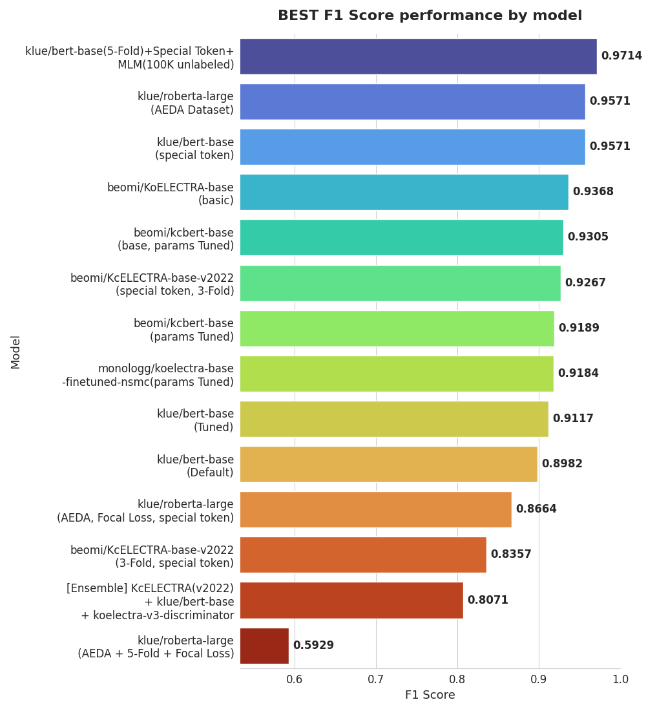

# Korean_AU 프로젝트

이 프로젝트는 혐오 발언(hate speech) 분류 모델을 학습하고 추론하는 과정을 포함하고 있습니다. 각 모듈의 역할 등에 대한 설명을 다음과 같이 정리하였습니다.


## 목차
1. [프로젝트 디렉터리 구조](#1-프로젝트-디렉터리-구조)
2. [코드에 대한 설명](#2-코드에-대한-설명)
    - 2.1 [데이터 처리 모듈 (data.py)](#21-데이터-처리-모듈-datapy)
    - 2.2 [모델 모듈 (model.py)](#22-모델-모듈-modelpy)
    - 2.3 [유틸리티 모듈 (utils.py)](#23-유틸리티-모듈-utilspy)
    - 2.4 [메인 모듈 (main.py)](#24-메인-모듈-mainpy)
    - 2.5 [추론 모듈 (inference.py)](#25-추론-모듈-inferencepy)
	- 2.6 [공통 인수 모듈(arguments.py)](#26-공통-인수-모듈-argumentspy)
---

## 1. 프로젝트 코드 구조
```plaintext
Korean_AU/
├── README.md                             # 프로젝트 설명 파일
├── LICENSE                               # 라이선스 파일
├── requirements.txt                      # 필요한 라이브러리 목록
├── NIKL_AU_2023_COMPETITION_v1.0/        # 데이터셋 폴더
├── Jupyter Notebook/                     # 데이터 전처리 Jupyter Notebook
│   └── preprocessing.ipynb
├── model/                                # 모델 체크포인트 및 결과 파일 폴더
│   └── results
└── src/                                  # 소스 코드 폴더
    ├── data.py
    ├── inference.py
    ├── main.py
    ├── model.py
    └── utils.py

```

## 2. 코드에 대한 설명

### 2.1 데이터 처리 모듈 (data.py)

데이터를 준비하고 처리하는 모듈입니다. 주요 클래스 및 함수는 다음과 같습니다:

- **hate_dataset class**  
  토크나이징된 입력을 받아 데이터셋 클래스로 반환하는 역할을 합니다.

- **load_data**  
  CSV 파일로부터 데이터를 읽어와서 데이터프레임으로 반환하는 함수입니다.

- **construct_tokenized_dataset**  
  데이터프레임을 입력으로 받아 토크나이징한 후 반환하는 함수입니다.

- **prepare_dataset**  
  CSV 파일로부터 데이터를 읽어와서 토크나이징된 데이터셋으로 반환하는 함수입니다.

### 2.2 모델 모듈 (model.py)

모델 및 토크나이저를 관리하고 학습을 진행하는 모듈입니다:

- **load_tokenizer_and_model_for_train**  
  Hugging Face로부터 사전학습된 토크나이저와 모델을 불러와 반환하는 함수입니다. 이때, `config.num_labels`를 2로 수정합니다.

- **load_model_for_inference**  
  모델과 토크나이저를 반환하는 함수로, 학습된 모델 체크포인트로부터 불러옵니다.

- **load_trainer_for_train**  
  모델과 데이터셋을 입력으로 받아 `Trainer`를 반환하는 함수입니다.

- **train**  
  모델, 토크나이저, 데이터셋을 받아와 `Trainer`를 통해 학습을 진행하고, 최종적으로 최상의 모델을 저장하는 함수입니다.

### 2.3 유틸리티 모듈 (utils.py)

여러 작업에 도움이 되는 유틸리티 함수들이 포함되어 있습니다:

- **compute_metrics**  
  `Trainer`에서 메트릭을 계산하기 위해 사용되는 함수입니다.

### 2.4 메인 모듈 (main.py)

모델 학습 및 추론에 필요한 설정(config)을 관리합니다:

- **parse_args**  
  모델 학습 및 추론에 쓰일 설정(config)을 관리하는 함수입니다.

### 2.5 추론 모듈 (inference.py)

학습된 모델을 통해 결과를 추론하는 기능을 담당합니다:

- **inference**  
  학습된(trained) 모델을 통해 결과를 추론하는 함수입니다.

- **infer_and_eval**  
  학습된 모델로 추론을 진행하고, 예측한 결과를 반환하는 함수입니다.
  
### 2.6 공통 인수 모듈 (arguments.py)

학습된 모델을 통해 결과를 추론하는 기능을 담당합니다:

- **add_common_args**  
  학습과 추론에 공통으로 사용되는 인수를 추가하는 함수입니다.

- **add_train_args**  
  학습에만 사용되는 인수를 추가하는 함수입니다.
  
- **add_infer_args**  
  추론에만 사용되는 인수를 추가하는 함수입니다.
 

  
  
  
  

---
